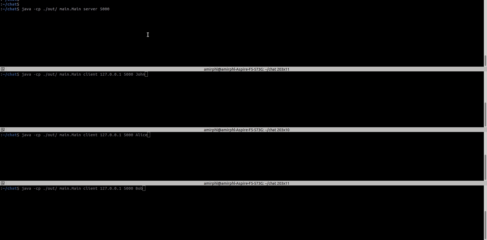

# GroupChat
This implementation is a simple Group Chat software that is purely written in Java.  
You can start a server and respawn multiple clients. Clients can be on different machines. Clients' messages are broadcasted, i.e., each client receives the payloads from all other clients.
The implementation utilizes Java sockets and multithreading.

## Demo
  

## How to run?
- Before running the server, allocate a **free** port for the server and open it in the firewall.
- Install JDK: ```sudo apt install openjdk-11-jdk```
- (optional) run: ```ldd /usr/lib/jvm/java-11-openjdk-amd64/lib/libawt_xawt.so```
- Compile the project through the command line: ```javac -cp ./src/ -d ./out/ ./src/main/Main.java```
- Run the server: ```java -cp ./out/ main.Main server 5000``` (5000 is the dedicated port; you can use other ports too.)
- To run a client: ```java -cp ./out/ main.Main client <server IP> <server port> <client name>```
    - for example: ```java -cp ./out/ main.Main client 127.0.0.1 5000 John```
